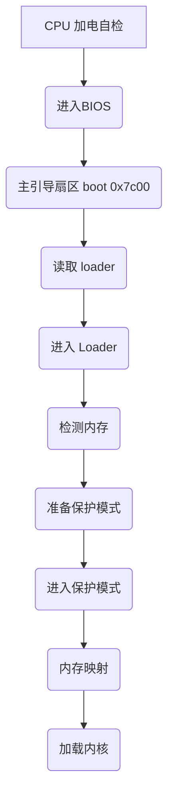

# PC启动流程

```mermaid
graph TD
A[CPU 加电自检] --> B(进入BIOS)
B(进入BIOS) --> C(主引导扇区 boot 0x7c00)
C(主引导扇区 boot 0x7c00) --> D(读取 loader)
D(读取 loader) --> T5(进入 Loader)
T5(进入 Loader) --> T6(检测内存)
T6(检测内存)--> T7(准备保护模式)
T7(准备保护模式)--> T8(进入保护模式)
T8(进入保护模式) --> T9(内存映射)
T9(内存映射) --> T10(加载内核)

```

主引导山区(MBR main boot record)只有512字节：

- 446可用
- 64硬盘分区数
- 2 0x55aa

